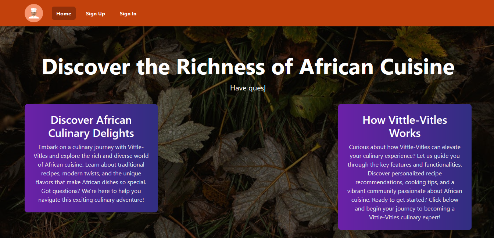

# Vital Vittles Recipe Project

## Table of Contents
a. About The Project 
b. Built With
c. Getting Started  
d. Prerequisites
e. Installation
f. Usage
g. Endpoints
h. Roadmap
i. Contributing
j. License
k. Contact
l. Acknowledgments

## About The Project

### Vital Vittles Recipe Website
Vital Vittles is your go-to destination for discovering the richness of African cuisine. Explore a diverse range of traditional and modern recipes that showcase the unique flavors of African dishes. Whether you're a seasoned chef or a passionate home cook, Vital Vittles brings you on a culinary journey filled with delights. Have questions? Our community is here to guide you through this exciting adventure!

### Vital Vittles API

The Vital Vittles API Project aims to provide a comprehensive solution for retrieving and managing culinary recipes. Whether you're building a cooking app, a meal planner, or just exploring diverse recipes, this API offers a versatile platform. It is designed to be user-friendly and easily integrable into various applications.

**Key Features**

- **Extensive Recipe Database**: Our API hosts a vast collection of recipes, ranging from classic dishes to innovative culinary creations.
- **Flexible Integration**: Built with Flask (Python), the API is designed for seamless integration into web and mobile applications.
- **Scalable and Customizable**: The project is structured to accommodate future enhancements, and the codebase is easily customizable to meet specific requirements.

**Why Choose Vital Vittles API?**

- **Rich Recipe Information**: Each recipe in the database includes detailed information such as ingredients, instructions, and nutritional facts.
- **User-Friendly Endpoints**: The API provides clear and intuitive endpoints for retrieving, adding, updating, and deleting recipes.
- **Open Source and Community-Driven**: This project is open source, welcoming contributions from the community to enhance and expand its features.

### Vital Vittles Community
Feel free to explore, contribute, and utilize the Vital Vittles API for your culinary-focused applications!

## Key Features (Our Unique Selling Points)

1.	 **Chatbots**: Engage with our interactive chatbots to get personalized recipe recommendations, cooking tips, and assistance in real-time. Whether you're a beginner or an experienced chef, our chatbots are here to enhance your culinary experience.
2.	**Access to Our Recipe API**: Seamlessly integrate our powerful Recipe API into your projects. Retrieve detailed information about a wide range of African recipes, making it easy to build cooking apps, meal planners, or explore diverse culinary creations.
3.	**Open-Source Community**: Vital Vittles is an open-source project, inviting the community to contribute and expand the platform. Join us in adding more recipes, features, and enhancements to create a comprehensive culinary resource for everyone.
4.	**Recipe Personalization**: Tailor your recipe recommendations based on your preferences, dietary restrictions, and culinary interests. Our platform learns from your interactions, ensuring that you receive suggestions that suit your taste and cooking style.
5.	**Multilingual Support**: Enjoy Vital Vittles in your preferred language. We provide multilingual support to make the culinary exploration accessible to a global audience.
6.	**Nutritional Insights**: Gain valuable nutritional insights for each recipe. Our platform provides detailed information about the nutritional content of dishes, helping you make informed choices that align with your health goals.
7.	**Smart Ingredient Substitution**: Discover alternative ingredients for recipes based on availability, dietary preferences, or allergies. Our platform suggests smart substitutions without compromising the essence of the dish.
8.	**Community-Driven Challenges**: Participate in cooking challenges organized by the Vital Vittles community. Showcase your culinary skills, learn new techniques, and connect with fellow food enthusiasts.
9.	**User-Friendly Interface**: Experience an intuitive and user-friendly interface that makes navigation a breeze. Whether you're browsing recipes, contributing to the community, or exploring cooking tips, our platform is designed for a seamless user experience.
10.	**Culinary Events Calendar**: Stay updated on culinary events, workshops, and festivals related to African cuisine. Our platform features a calendar that highlights exciting opportunities for food lovers to connect and celebrate together.
11.	**Create Recipes**: Unleash your culinary creativity by contributing your own recipes to the Vital Vittles platform. Share your favorite dishes, cooking techniques, and unique twists, and let the community discover and appreciate your culinary expertise.

Feel free to explore these unique features and elevate your culinary journey with Vital Vittles!


## Built With

- **Flask (Python)**: A micro web framework written in Python. Flask is used to build the backend of the Vital Vittles API, providing a robust and flexible foundation for handling recipe data, user interactions, and more.

- **React**: A JavaScript library for building user interfaces. React is employed to create an interactive and dynamic frontend for Vital Vittles, ensuring a smooth and engaging user experience when exploring recipes and interacting with the platform.

- **SQL (Structured Query Language)**: A domain-specific language used for managing and querying relational databases. SQL is utilized to structure and manage the database that stores the extensive collection of recipes available on Vital Vittles.

- **Redux**: A state management library for JavaScript applications. Redux is integrated with React to manage the state of the application efficiently, providing a predictable and centralized way to handle data.

- **Auth0**: An authentication and authorization platform. Auth0 is used to secure user accounts, ensuring a safe and reliable environment for users to explore and contribute to Vital Vittles.

- **Swagger/OpenAPI**: Tools for designing, building, and documenting APIs. Swagger or OpenAPI specifications are employed to provide a clear and standardized interface for interacting with the Vital Vittles API.

- **Docker**: A platform for developing, shipping, and running applications in containers. Docker is used to containerize the Vital Vittles application, simplifying deployment and ensuring consistency across different environments.

- **GitHub Actions**: Automate workflows in software development. GitHub Actions are employed for continuous integration and deployment, streamlining the development process and ensuring code quality.

- **Amazon S3**: Object storage service for secure and scalable data storage. Amazon S3 may be used to store media files, images, or other assets related to recipes on Vital Vittles.

The combination of Flask, React, SQL, Redux, Auth0, Swagger/OpenAPI, Docker, GitHub Actions, and Amazon S3 creates a powerful and scalable architecture for Vital Vittles. This tech stack ensures the efficient handling of recipe data, responsive user interfaces, and a robust foundation for future enhancements.

## Getting Started

This section will guide you on setting up the project locally. 
Follow these steps to have a local copy up and running.
Step 1

-	Click on this link to our website : https://vital-vittles.vercel.app/


-	Sign up with your email and password
 

-	Then you can sign in with the registered email
 

-	The home page after login
 

-	Recipe Tab: where you are able to access the vast database of African Recipes 
 
-	Create your Recipe
 

-	Chatbot
 
Feel Free to Explore the Vital Vittles Robust Website.

### Prerequisites

Make sure you have the following dependencies installed:

•	**Node.js and npm**: Essential for building and running the frontend application.
  
•	```bash

•	 npm install -g npm@latest
•	Python and Flask: Required for the backend development using the Flask micro web framework.
•	SQL Database (e.g., PostgreSQL, MySQL): Ensure a compatible SQL database is available, as specified in the tech stack.
•	Redux and React: Necessary for managing state and building the interactive frontend.
•	Auth0 Account: Create an account on Auth0 for authentication and authorization purposes.
•	Swagger/OpenAPI Tools: Use Swagger or OpenAPI tools for designing, building, and documenting APIs.
•	Docker: Install Docker for containerizing the application, simplifying deployment and ensuring consistency.
•	GitHub Actions: Set up GitHub Actions for automating workflows, including continuous integration and deployment.
•	Amazon S3 Account: If using Amazon S3 for object storage, create an account and configure it accordingly.
Installation
-	Clone the repository:
-	Bash
-	git clone https://github.com/your_username/recipe-api.git
Install dependencies:
-	bash
-	npm install
-	Set up your database (if using SQL, provide connection details).
Start the server:
-	Bash
-	npm start
Ensure all prerequisites are met to smoothly run and develop on the Vital Vittles project.
This section provides a clear guide on the prerequisites, installation steps, and necessary dependencies for working on the Vital Vittles project. Feel free to adjust any details based on your specific project requirements.
